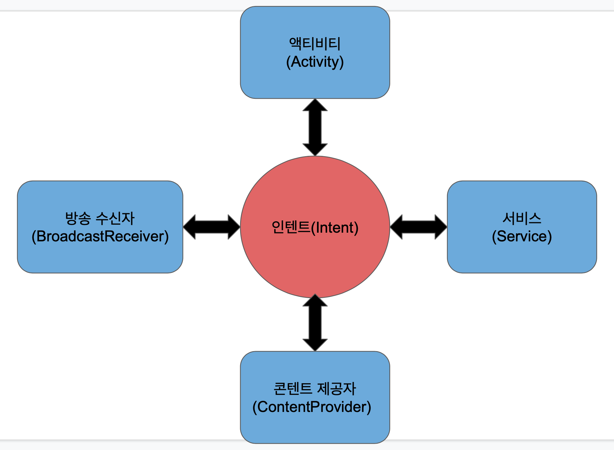

# 4대 컴포넌트란?

 

안드로이드 애플리케이션을 구성하는 기본요소 4가지를 4대 컴포넌트라 부르며 그 종류는 아래와 같다
- 액티비티(Activity) 
- 서비스(Service) 
- 브로드 캐스터(BroadCast Receiver) 
- 콘텐츠 제공자(Content Provider) 

각 컴포넌트들의 정보는 AndroidManifest.xml 파일에 저장되어 있다.

컴포넌트들은 아래와 같은 특징을 가진다.
- 각 컴포넌트들은 하나의 독립적인 형태로 존재함.
- 각 컴포넌트들은 고유의 기능을 수행함.
- 각 컴포넌트들은 인텐트를 통해 서로 상호작용함.

## 액티비티(Activity)
액티비티는 사용자가 앱과 상호작용하는 하나의 화면을 의미하며 사용자에게 드러나는 화면을 의미한다. 
**사용자와 상호작용**을 담당하는 인터페이스이기 때문에 적어도 반드시 **하나 이상의 액티비티를 포함**하고 있어야 한다. 

- AppCompatActivity 클래스를 상속받아 사용한다.
- 2개 이상의 Activity를 동시에 실행시킬수 없다.
- 1개 이상의 View or ViewGroup을 포함한다.
- Activity 내에 Fragment를 추가하 화면을 분활시킬수 있다.
- 반드시 애플리케이션은 하나 이상의 액티비티를 포함 하여야 한다.

## 서비스(Service)

서비스는 **사용자와 직접적으로 상호작용하지는 않는다.** 
이것은 백그라운드에서 어떠한 작업을 처리하기 위해서 사용하는데, 
애플리케이션을 사용하면서 파일을 다운로드할 때 서비스를 사용한다.
서비스는 눈에 보이지 않는다고 다른 스레드에서 동작한다고 생각하지만 사실은 **메인 스레드에서 동작**한다. 따라서 서비스 내에서 별도의 스레드를 생성하여 작업을 처리하여야 한다.

- 네트워크(Network)와 연동이 가능하다.
- 별도의 UI를 가지지 않으며 백그라운드에서 수행된다.
- 애플리케이션이 종료되어도 이미 시작이 된 서비스는 백그라운드에서 계속 동작한다.
- 액티비티와 서비스는 UI스레드(메인 스레드)라는 동일한 애플리케이션 스레드로 실행된다.
- Manifest 옵션으로 export, enable 두 개가 있습니다. (export = 앱 외부에서 접근 가능한가, enable = 서비스가 인스턴스화 가능한가)

## 방송 수신자(BroadCast Receiver)
브로드 캐스터는 안드로이드 OS로부터 발생하는 **각종 이벤트와 정보를 받아와 핸들링**하는 컴포넌트이다. 
브로드 캐스터는 사용자 인터페이스를 표시하지 않지만, 상태 표시줄 알림을 생성하여 사용자에게 이벤트가 발생했다고 알릴 수 있다. 
사용자 안드로이드 디바이스의 시스템 부팅시 앱 초기화, 네트워크 끊김 등등 **특수한 이벤트에 대한 처리**나 배터리 부족 알림 ,문자 수신과 같은 **정보를 받아 처리**를 해야 할 필요가 있을 때 동작합니다. 
즉, 안드로이드 OS에서 메신저앱 또는 문자 메시지가 오면 모든 앱에 "메시지가 왔다"라는 하나의 정보를 **방송(BroadCast)** 합니다.
이 메시지를 받기 위해 **브로드캐스트 리시버**를 구현하면 되며 해당 정보가 오면 특정 이벤트를 처리할 수가 있습니다.
- 거의 대부분 UI를 가지지 않는다.
- 안드로이드 디바이스의 특수한 이벤트에 대응하기 위해 사용한다.
- 특정한 상황을 제외하고는 브로드캐스트는 시스템에서 시작한다.
- 정적 브로드캐스트와 동적 브로드캐스트가 있다.
- 정적 브로드캐스트란 매니패스트에 등록하는 방송 수신자(BroadCast Receiver)를 말한다.
- 동적 브로드캐스트란 콘텍스트에 등록하는 방송 수신자(BroadCast Receiver)를 말한다.
- enable, export는 서비스와 같은 역할을 한다.

## 콘텐츠 제공자(Contents Provider)
콘텐트 제공자(Content Provider)는 **데이터를 관리하고 다른 애플리케이션의 데이터를 제공**하는 데 사용되는 컴포넌트이다. 
특정한 애플리케이션이 사용하고 있는 데이터베이스(DB)를 공유하기 위해 사용하며 애플리케이션 간의 데이터 공유를 위해 표준화된 인터페이스를 제공합니다.

- 작은 데이터는 인텐트(Intent)로 애플리케이션끼리 공유 가능하지만  
콘텐츠 제공자(Contents Provider)는 음악이나 사진같이 용량이 큰 데이터를 공유하는데 사용함
- 프로바이더는 데이터의 Read(읽기), Write(쓰기)에 대한 퍼미션이 있어야 애플리케이션에 접근이 가능합니다.
- 데이터베이스에서 흔히 사용되는 CURD(Create, Read, Update, Delete) 원칙을 준수합니다.
- 생명주기가 존재하지 않습니다.
- 다른 애플리케이션의 ContentProvider에 접근할수 있다.
- 외부 애플리케이션의 데이터베이스(DB)접근을 제한하거나,공유하고 싶은 데이터만 공유할수 있게 한다.

