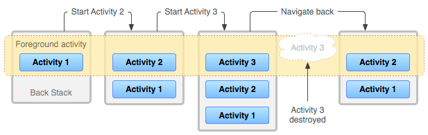
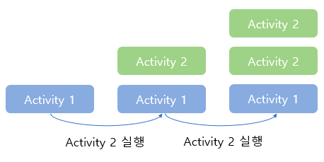
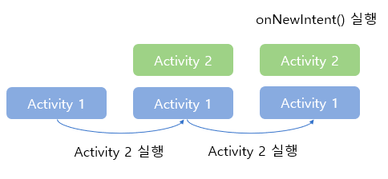
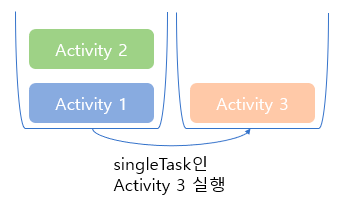
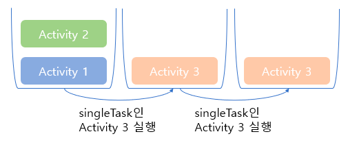

# 액티비티 스택(Activity Stack)
안드로이드 에서 Activity는 Stack형태로 관리된다.<br>
FirstActivity에서 SecondActivity를 호출하면 위에 쌓이고,<br>
SecondActivity에샤 ThirdActivity를 호출하면 위에 쌓이는 식으로 만들어진다.<br>
아래의 이미지외 같은 형태로 관리된다.



## Task 와 Back Stack

### Task
태스크는 액티비티 스택에 대한 메타 데이터와 여러 정보의 콜렉션이다.<br>

- #### 프로세스 vs 태스크
   프로세스와 태스크는 혼동하기 쉽다.<br>
프로세스의 경우 다른 운영체제와 동일하게 **어플리케이션의 독립적인 실행 단위**를 말한다.<br>
태스크는 안드로이드에서 프로세스와 무관하게 **실행되는 액티비티의 정보를 저장**하고 있으며,<br>
태스크를 통해 어플리케이션의 화면의 흐름을 관리할 수 있다.
### Back Stack
먼저 안드로이드에서 Stack은 **액티비티가 순서대로 저장되어 관리되는 공간**을 의미한다.<br>
액티비티들은 스택형태로 저장되는데 이를 Back Stack이라고 한다.<br>
뒤로가기를 누를 경우 최상단의 액티비티를 제거(pop)한다. 혹은 startActivity()를 통해 새로운 액티비티를 <br>
최상단에 추가하여 새 액티비티가 기존의 최상단 액티비티를 가릴 경우 기존 액티비티는 일시 중지된다.

## 액티비티 스택 관리
기본적으로 **LIFO(Last in First Out)형태**의 Stack으로 관리된다.<br>
Activity를 호출하다 보면 Activity에 대해 중복 문제가 발생하곤한다.<br>
중복을 방지하거나, Activity에 대한 **흐름을 제어**하고 싶을 때 사용한다.<br>
하지만, 액티비티 스택을 변경할때는 **분명한 의도를 가지고 작업**해야하며 <br>
**의도치 않은 상황이 발생**할 확률이 매우높기 때문에 가급적 작업하지 않는게 좋다.<br>
안드로이드에서 액티비티 스택을 관리하는 방법은 2가지로 나뉜다. <br>

## AndroidManifest의 LaunchMode의 옵션

- standrad(LIFO)<br>
  Default로 설정되는 모드이다. 시스템은 항상 새로운 액티비티를 생성하게 된다.<br>

  <br>


- singleTop<br>
  해당 모드는 작업 스택 top에 X라는 액티비티가 존재할 때, X를 실행시키면 기존 액티비티를 재활용하고 <br>
onNewIntent()를 호출한다. 하지만 여전히 여러 액티비티가 생성될 수 있음을 유의해야 한다.<br>
다음 상황에서 Activity 3을 실행하고 다시 Activity 2를 실행하면 1->2->3->2 순으로 스택에 존재하게 된다. <br>
(참고로 onNewIntent() 후에는 onResume()이 호출된다.)

  <br>


- singleTask<br>
  다중 인스턴스가 존재하지 않는다. 그리고, 오직 태스크(스택)의 루트에만 존재할 수 있다.
  아래의 이미지를 예로 들면, Activity3는 태스크의 루트에만 존재할수 있으므로<br>
  아예 새로운 태스크를 만들고 그 안에 Activity3이 들어간것을 알수있다.

  <br>


- singleInstance<br>
  singleTask와 마찬가지로 다중 인스턴스로 존재할 수 없다. <br>
  큰 차이점은 하나의 태스크에 하나의 액티비티만 존재할 수 있다.<br>
<br>

## Intent Flag
아래의 3가지 Intent Flag 이외에도 다양한 Intent Flag가 존재한다.

- FLAG_ACTIVITY_NEW_TASK (singleTask)<br>
새로운 태스크를 생성하고 그 태스크에 호출하는 액티비티를 추가한다. <br>
단, 기존에 존재하는 태스크 중에 생성하려는 액티비티와 동일한 task affinity를 <br>
가진 태스크가 존재한다면 그 태스크에 추가된다.
- FLAG_ACTIVITY_SINGLE_TOP (singleTop)<br>
  호출하는 액티비티가 스택에 존재할 경우 해당 액티비티를 최상위로 올리고,<br>
  스택에 존재하는 기존 액티비티는 모두 제거한다.
- FLAG_ACTIVITY_CLEAR_TOP<br>
  호출하는 액티비티가 스택에 존재할 경우 해당 액티비티를 최상위로 올리고, <br>
스택에 존재하는 기존 액티비티는 모두 제거한다.
### Intent Flag 사용법
- setFlag
  - 기존에 적용된 flag를 삭제하고 다시 설정한다
  ```kotlin
   intent.setFlags(Intent.FLAG_ACTIVITY_CLEAR_TOP) //FLAG_ACTIVITY_CLEAR_TOP로 설정한다
   ```
- addFlag
  - flag를 추가한다
   ```kotlin
    intent.addFlags(Intent.FLAG_ACTIVITY_CLEAR_TOP) //FLAG_ACTIVITY_CLEAR_TOP를 추가한다
   ```