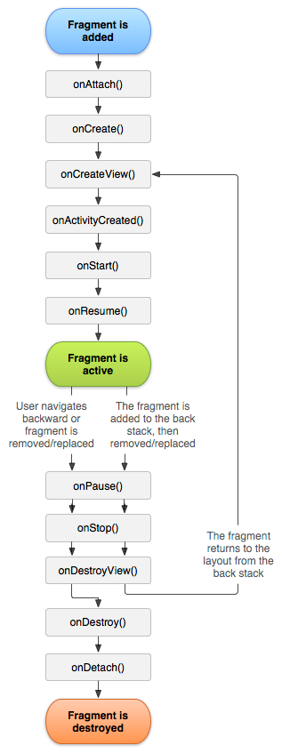
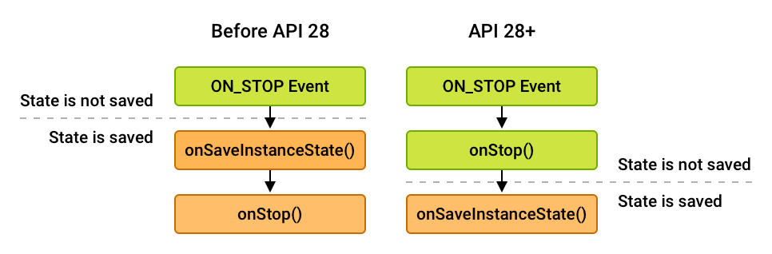
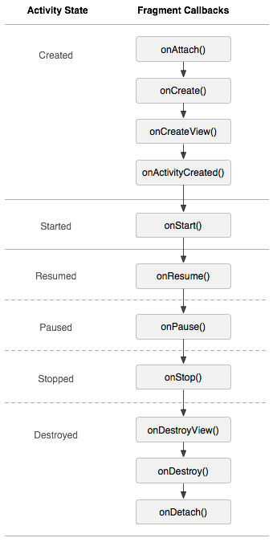

# 프래그먼트 생명주기(Fragment Lifecycle)

## 프래그먼트(Fragment)란?
프래그먼트(Fragment)는 동작 또는 Activity내의 UI일부를 나타낸다. 
여러 개의 fragment를 하나의 액티비티에 결합혀여 창이 여러 개인 UI를 빌드할수 있다. 
하나의 프래그먼트를 **여러 액티비티에서 재사용**할 수 있다.
프래그먼트는 자체 수명 주기를 가지고, 자체 입력 이벤트를 받으며,
액티비티 실행 중에 추가 및 제거가 가능한 **액티비티의 모듈식 섹션**이라고 생각하면 된다.

- 재사용이 가능하다
- fragment -> Activity의 모듈식 섹션이다
- fragment는 자체적인 생명주기를 갖고, 자체 입력 이벤트를 수신한다
- 생명주기는 호스트 액티비티의 생명 주기에 직접적으로 영향을 받는다
  - ex) 액티비티가 일시 정지 되는 경우,그 안의 모든 프래그먼트도 일시정지 되며, 
        액티비티가 소멸 될시,그 안의 모든 프래그먼트도 소멸 된다.
- 다른 액티비티에 재사용 할 수 있는 "하위 액티비티" 같은 개념이다
- 프래그먼트를 액티비티 레이아웃의 일부로 추가하는 경우,  
  이는 액티비티의 뷰 계층 내부의 ViewGroup안에 존재한다

그러나 프래그먼트가 액티비티 레이아웃의 일부분이어야만 하는 것은 아니다.  
나름의 UI가 없는 프래그먼트도 액티비티를 위한 보이지 않는 작업자로 사용할 수 있다.

## 프래그먼트 생명주기(Fragment Lifecycle)
### onAttach()

- 프래그먼트가 액티비티에 붙을때 호출 된다.
- 인자로 Context가 주어진다.
  -  만약 부모에 listener interface를 implement했다면 형변환을 통해 가져올 수 있다.

### onCreate()

- fragment를 생성할 때 호출
- 프래그먼트의 기본 요소 중 프래그먼트가 일시정지되거나 중단되었다가 재개되었을 때  
유지하고자 하는 것을 초기화해야 한다.
- Activity와 달리 이곳에서 뷰를 그리지 않는다.

### onCreateView()

- fragment가 자신의 인터페이스를 처음으로 그릴 때 호출된다.
- View를 반환해야 한다
  - UI를 제공 X -> NULL반환
- 프래그먼트 레이아웃의 루트이다.

### onActivityCreated()

- 액티비티에서 프래그먼트를 모두 생성하고 난 다음 호출된다.
- View lifecycle owner 는 이때 INITIALIZED 상태에서 CREATED 상태로 변경됐음을 알린다.

### onStart()

- Fragment 가 사용자에게 보여질 수 있을 때 호출된다.
-  Activity 의 onStart()와 유사하다.

### onResume()

- 프래그먼트가 화면에 보여지는 단계이다.
- 사용자에게 포커스를 잡았으며 사용자와 상호작용이 가능하다.
- nResume() 이 호출되지 않은 시점에서는 입력을 시도하거나  
포커스를 설정하는 등의 작업을 임의로 하면 안된다

### onPause()

- 사용자가 프래그먼트를 떠난다는 것을 알리는 첫번째 신호이다.
- Activity와 동일하다

### onStop()

- 프랴그먼트가 더이상 화면에 보이지 않을때 호출된다.
- 더 이상 프래그먼트는 동작하지 않는다
- API 28 버전 부터 onSaveInstanceState() 함수와 onStop() 함수 호출 순서가 달라졌다. 

### onDestroy()

- 프래그먼트를 제거하기 직전에 호출된다.
- Fragment View 에 대한 모든 참조가 제거되어야 한다.

### onDetach()

- 프래그먼트 제거를 완료하고 액티비티와의 연결도 해제 시킨다.
- 프래그먼트 라이프사이클의 끝을 알리는 매서드 이다.

## 액티비티의 생명주기와 프래그먼트의 생명주기

- activity가 onCreate() 호출을 받아서 생성되었으면, fragment는 onActivityCreated() 함수까지 진행가능
- onCreate() : fragment가 처음 만들어질때 호출한다. 데이터를 초기화 시키거나  
  onPause(), onStop() 단계에 갔다가 다시 데이터 복원할 정보를 여기서 처리한다.
- onCreateView() : fragment UI 초기화 할 때 호출한다.
- onPause() : 사용자가 fragment를 떠날 때 호출한다.포커스를 가지고 있지는 않지만 back stack에 
   있을 수 있으므로  완전히 사라지는 것은 아니다. 여기서 데이터를 저장하는 것이 좋다.
- onDestroy() : activity가 destroy 될 때 같이 destory 된다.
