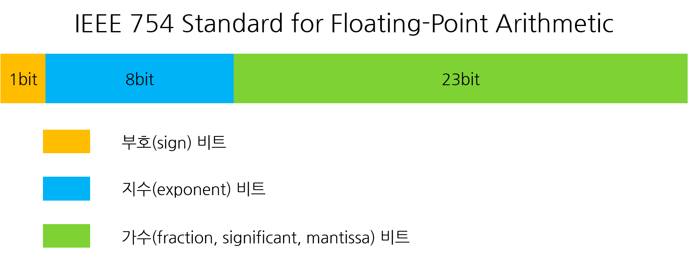

# 부동소수점
일반적으로 수를 표현하는 방법은 아래와 같은 것들이 있다
- 정수를 표현하는 방식
- 고정소수점
- 부동소수점

## 정수를 표현하는 방법
- 10진수 : 123
- 16진수 : 7B // 0111 1011
- 8진수 : 173 // 001 111 011 
- 2진수 : 1111011 

## 실수를 표현하는 방법
컴퓨터는 숫자를 표현할 때 기본적으로 2진수를 사용합니다.
ex)0.75 = 0.5 + 0.25 => 0.11
하지만 263.3 같은 실수를 표현해보면
263 => 100000111
0.3 => 0.01001100110011......(0011)의 무한반복이 발생한다 
위의 사례처럼 2진수로 표현하지 못하는 값들이 발생하게 된다. 이럴때는 표현할수있는 가장 가까운 값을 저장한다. 
이 근사치를 저장하는 방법은 두가지가 있습니다.
### 고정소수점
정수를 표현하는 비트 수와 소수를 표현하는 비트 수를 미리 정해 놓고 해당 비트 만큼만 사용해서 숫자를 표현하는 방식이다. 
실수 표현에 4byte(32bit)를 사용하고 그 중 부호(아래에서 괄호로 표시) 1bit, 정수 16bit, 소수 15bit를 
사용하도록 약속해 놓은 시스템에 있다고 가정합니다. 이렇게 약속 된 시스템에서 263.3을 표현하면 
(0)0000000100000111.010011001100110 이렇게 표현된다. 
정수를 표현하는 bit를 늘리면 큰 숫자를 표현할 수 있지만 정밀한 숫자를 표현하긴 힘들다. 
그래서 소수를 표현하는 bit를 늘릴 경우 정밀한 숫자를 표현할 수 있지만 큰 숫자를 표현하지 못한다. 
이러한 문제점을 해결하기 위해 부동소수점을 사용한다.
### 부동소수점

부동 소수점을 표현하는 방식도 정하는 방식에 따라 다를 수 있지만  
일반적으로 사용하고 있는 방식은 IEEE에서 표준으로 제안한 방식이다. 
고정 소수점으로 나타낸 263.3을 2진수 부동 소수점 방식으로 변환해 보면 다음과 같다 
100000111.010011001100110... 을 맨앞의 1의 바로뒤로 소수점을 옮겨 표현하도록 하면 
1.00000111010011001100110... * 2^8(2의 8승) 으로 표현 된다. 
- 2^8의 8을 지수라고 하고 하늘색 부분에 기록한다. (IEEE 754 표현 방식에서는 127 + 지수를 기록한다.)
- 소수점 이후 숫자열 전체를 가수라고 하고 연두색 부분에 기록한다.

이 방식에 따라서 263.3을 기록하면

- 부호 비트(1 bit) : 0 (양수)
- 지수 비트(8 bit) : 10000111 (127 + 8 = 135)
- 가수 비트(23 bit) : 00000111010011001100110 이렇게 표현할 수 있습니다.

하지만! 여기서도 0.010011001100110은 정확히 0.3을 나타낼 수는 없다. 
10진수로 나타내 보면 0.29998779296875을 나타냅니다.